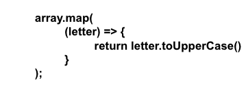
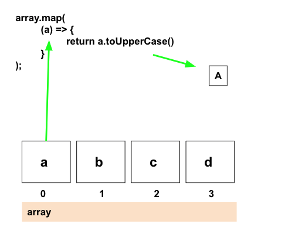
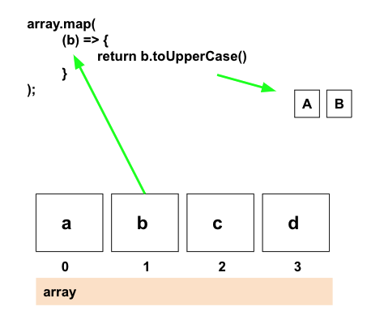
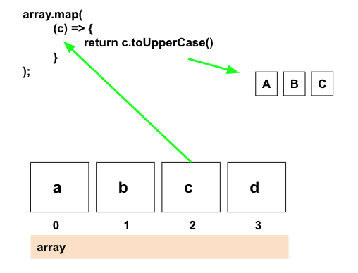
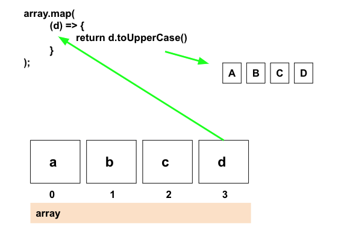
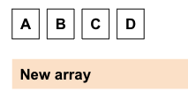

# Arrays
## SWBAT
- Create arrays
- Access elements from arrays
- Add elements to arrays
- Remove elements from arrays
- Use forEach to loop through arrays
- Use filter and find to find specific elements
- Use map to return a transform arrays


## Deliverables 

The owner of a small bookstore has hired you to build them an app to help keep track of their book inventory. 

1. Store the books and customer names in arrays. 

2. Write a functions that can transform book elements. 
    - Change books to uppercase 
    - Remove the author 
    - remove the title.

3. Write a function that will filter books out by a search term.

4. Write a function that returns a specific book by search term. 


## Arrays
Arrays are list-like objects with indexes and elements. 
Each element has a specific index starting with 0. 
```
// Arrays can be defined with []
// It can start empty or with elements pre-populated
const arr = [];
const arr = [1,2,3];


//Accessing arrays
//bracket notation
arr[0]

//Adding items to arrays
arr.push(4)
arr.unshift(0)
books.splice(1, 0,, 6)

//Removing items from arrays
arr.pop()
arr.shift()
books.splice(2,2);

//Does not mutate the original array
books.slice(2);

//Make a copy of the array
arr2 = [...arr]
arr3 = [...arr, 7]

```

## Looping Through Arrays
```
// a for loop is a classic loop for looping through every index of an array
for(let i = 0; 0 < arr.length; i++){
    console.log(arr[i])
}

// a for each loop loops through every element in the array without needing 'let i = 0; 0 < arr.length; i++'
for(element of arr){
    console.log(element)
}
```

## Higher-Order Functions 
forEach, map, and filter are all Higher Order functions, functions that return a callback function.

```
// forEach loops through arrays
// forEach calls the callback on every element in the array one at a time
// the param in the callback represents the element
// forEach returns undefined 
arr.forEach((num) => console.log(num))

//map
// map loops through the array
// map calls the callback on every element in the array one at a time
// map creates a new array, and fills it with the return of the callback.
arr.map((num) => num*2)

//filter 
// filter loops through the array
// filter calls the callback on every element in the array one at a time
// filter creates a new array, and if the callback returns true will add the element to the new array, if it returns false filter will skip that element.
arr.filter((num) => num%2 === 0)

//find
// Find is like filter but it will return the first element that returns true from the callback
arr.find((num) => num%2 === 0)

//Callbacks can be defined within the higher-order function OR they can be passed in from a variable.

const square = (num) => num * num

arr.map(square)

```
#### Here's an array.   


#### Here's map being called on the array. The callback in map transforms a string to uppercase.    



#### Map calls the callback on every element in the array. The element gets added to a new array until we reach the end of the array.






#### At the end of the array map returns the new array with the transformed elements.




